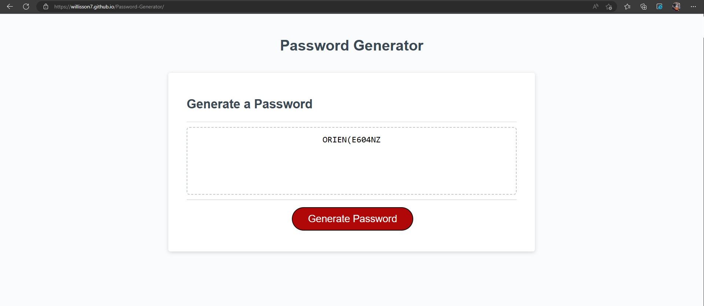

# Password-Generator

# UserStory 
 The challenge was to take starter code and complete it to create a functioning application for generating a random password. 
 The application will take specific user input regarding character types and password length. It will match user input regarding character types into predetermined 
 categories: Symbols, Numbers, Uppercase and Lowercase. The application will loop through user input to determine password length and what character types the password will contain. After determination, the application will apply that new information to loop through character types, randomly selecting a character x times where x is equal to the users desired length. The result is returned as a randomly generated password.

